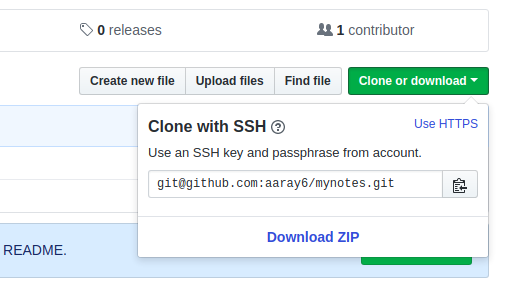

# git notes

## to put existing content into repository

```console
git clone <URL> <somefolder>
cp -R <somefolder>/.git <existing folder>
```

## check remote URL

```console
git remote -v
```

## change remote URL (from https to ssh or from ssh to https)

get the URL


```console
git remote set-url origin <remote-URL>
```

## some commands

```console
git push *
```

## GIT CRLF

```console
git config core.autocrlf
git config --global core.autocrlf false
```